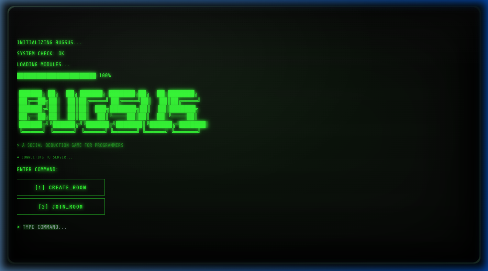
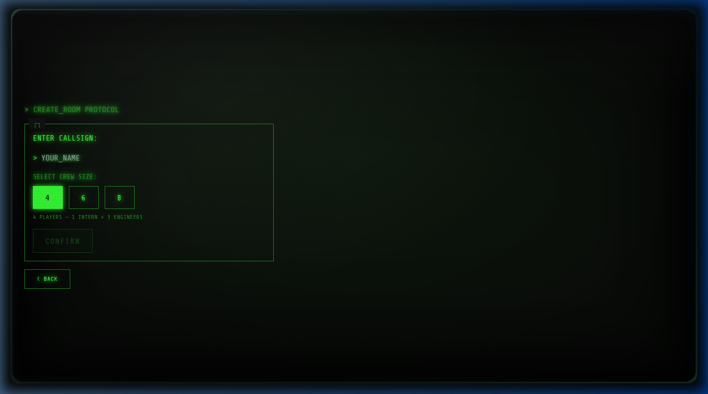
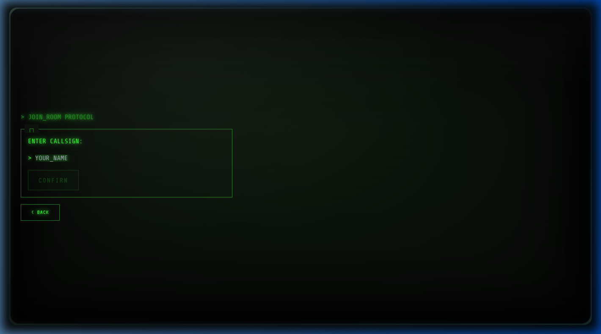

<div align="center">

# 🐛 BugSus

**A multiplayer social-deduction game for programmers.**

*One player is secretly the **Intern** — deploying subtly broken code while blending in with the engineering team. Everyone else is an **Engineer** racing to ship legitimate features and identify the saboteur before it's too late.*

[](https://react.dev)
[](https://www.typescriptlang.org/)
[](https://vitejs.dev)
[](https://socket.io)
[](https://vercel.com)

</div>

---

## 🎬 Intro


> *Seamless CRT phosphor boot animation → multiplayer lobby → live code editor with real test cases.*

---

## 📸 Screenshots

<table>
  <tr>
    <td align="center"><b>Boot Screen</b></td>
    <td align="center"><b>Create Room</b></td>
    <td align="center"><b>Join Room</b></td>
  </tr>
  <tr>
    <td></td>
    <td></td>
    <td></td>
  </tr>
</table>

---

## 🎮 How to Play

### Roles

| Role | Probability | Goal | Objective |
|------|-------------|------|-----------|
| 🔧 **Engineer** | 75% | Identify and eject the Intern | Complete coding tasks correctly |
| 🐛 **Intern** | 25% | Survive all 3 rounds undetected | Deploy subtly broken code |

### Game Flow

```
Boot Screen
    │
    ├─ [CREATE_ROOM] ──┐
    └─ [JOIN_ROOM]  ───┴─→ Lobby
                               │
                        Category Vote (15s)
                        (FRONTEND / BACKEND / OOPS / DSA)
                               │
                          Role Reveal
                               │
                          Game Round (3 min)
                          ┌────┴────────────────────┐
                          │  Monaco Code Editor      │
                          │  Live Test Cases         │
                          │  In-Game Chat            │
                          └────┬────────────────────┘
                               │
                   ┌───── Emergency Meeting ←── timer / button
                   │           │
                   │         Vote (20s) → Ejection Reveal
                   │           │
                   │      Round Summary
                   │     ╔════════╗
                   └────►║ Repeat ║ up to 3 rounds
                         ╚════════╝
                               │
                          Final Screen
```

### Win Conditions

| Condition | Winner |
|-----------|--------|
| Intern is successfully ejected | **Engineers** 🏆 |
| Engineers are reduced to ≤ 1 remaining | **Intern** 🏆 |
| Intern survives all 3 rounds | **Intern** 🏆 |

---

## 🧩 Task Categories

Each round the crew votes on one of four categories. Tasks are randomly selected from a pool of 12 per category.

### DSA
Array manipulation, sorting, searching, and classic algorithms — `twoSum`, `binarySearch`, `fibonacci`, `flatten`, `intersection`, and more.

### FRONTEND
Pure utility functions common in frontend codebases — `clamp`, `debounce`, `throttle`, `deepClone`, `memoize`, `formatUSD`, `groupBy`, and more.

### BACKEND
Functional programming and server-side patterns — `compose`, `pipe`, `curry`, `EventEmitter`, `LRUCache`, `retry`, `rateLimiter`, and more.

### OOPS
Object-oriented design patterns — `Animal` inheritance, `Stack`, `Queue`, `Singleton`, `Observer`, `LinkedList`, mixins, decorators, and more.

### 🕵️ Sabotage Tasks (Intern only)
Each category has 5 matching sabotage tasks. These are subtly wrong implementations designed to corrupt the codebase:

| Category | Example Sabotage |
|----------|-----------------|
| **DSA** | Off-by-one `twoSum`, fence-post `fibonacci`, corrupt sort order |
| **FRONTEND** | Inverted `clamp`, undercut `truncate`, poisoned query parser |
| **BACKEND** | Short-circuiting `pipe`, double-firing `EventEmitter`, LRU evicting newest |
| **OOPS** | Mismatched `speak()`, `Stack.pop()` returns wrong item, Singleton that resets every 3rd call |

---

## 🖥️ Tech Stack

| Layer | Technology |
|-------|-----------|
| **Framework** | [React 18](https://react.dev) + [TypeScript 5](https://www.typescriptlang.org/) |
| **Build Tool** | [Vite 5](https://vitejs.dev) |
| **Realtime** | [Socket.IO 4](https://socket.io) (client + server) |
| **Styling** | [Tailwind CSS 3](https://tailwindcss.com) |
| **Code Editor** | [Monaco Editor](https://microsoft.github.io/monaco-editor/) via `@monaco-editor/react` |
| **UI Primitives** | [Radix UI](https://www.radix-ui.com/) |
| **Fonts** | [VT323](https://fonts.google.com/specimen/VT323) · [Share Tech Mono](https://fonts.google.com/specimen/Share+Tech+Mono) (Google Fonts) |
| **Testing** | [Vitest](https://vitest.dev) + [Testing Library](https://testing-library.com/) |
| **Code Execution** | `new Function()` in-browser sandbox |
| **Backend Host** | [Render](https://render.com) |
| **Frontend Host** | [Vercel](https://vercel.com) |

---

## 📁 Project Structure

```
BugSus/
├── readme.md
├── vercel.json
├── client/                            # Vite + React frontend
│   ├── src/
│   │   ├── components/
│   │   │   ├── BootScreen.tsx         # Title / mode-select screen
│   │   │   ├── CRTFrame.tsx           # Scanlines, vignette, grain overlay
│   │   │   ├── CRTIntro.tsx           # Phosphor tube power-on animation
│   │   │   ├── CRTTransition.tsx      # Screen-to-screen wipe transitions
│   │   │   ├── CategoryVoteScreen.tsx # Live vote bars, 15s timer
│   │   │   ├── RoleRevealScreen.tsx   # Glitch → role reveal
│   │   │   ├── MainGameScreen.tsx     # 3-col layout: crew | editor | comms
│   │   │   ├── EmergencyScreen.tsx    # Dramatic interstitial with countdown
│   │   │   ├── MeetingScreen.tsx      # Vote UI with live tally + ejection reveal
│   │   │   ├── RoundSummaryScreen.tsx # Post-round debrief with stats
│   │   │   ├── FinalScreen.tsx        # Win/loss screen with intern identity reveal
│   │   │   ├── CreateJoinScreen.tsx   # Name + room code entry
│   │   │   ├── LobbyScreen.tsx        # Waiting room
│   │   │   └── editor/
│   │   │       └── CodeEditor.tsx     # Monaco editor wrapper
│   │   ├── data/
│   │   │   └── tasks.ts               # 68 tasks (48 engineer + 20 intern sabotage)
│   │   ├── types/
│   │   │   ├── task.ts                # Task, TestCase, TaskCategory types
│   │   │   └── game.ts                # Full game state types
│   │   ├── utils/
│   │   │   └── validateTask.ts        # new Function() executor + deepEqual
│   │   └── pages/
│   │       └── Index.tsx              # Root game state machine (11 screens)
│   └── package.json
└── server/                            # Socket.IO Node backend
    └── src/
        └── index.ts                   # Room management + event bus
```

---

## 🚀 Getting Started

### Prerequisites
- [Node.js](https://nodejs.org/) v18+ (or [Bun](https://bun.sh/))

### Install & Run (Frontend)

```bash
# Clone the repo
git clone https://github.com/Harish-vinayagam/BugSus.git
cd BugSus/client

# Install dependencies
npm install

# Start the dev server
npm run dev
```

Open [http://localhost:5173](http://localhost:5173) in your browser.

### Install & Run (Backend)

```bash
cd BugSus/server

# Install dependencies
npm install

# Start the server (default port 3001)
npm run dev
```

> The client's `.env` points to `https://bugsus.onrender.com` by default. To use your own local server, update `VITE_SERVER_URL` in `client/.env`.

### Other Commands

```bash
npm run build       # Production build → dist/
npm run preview     # Preview the production build locally
npm run test        # Run unit tests (Vitest)
npm run test:watch  # Run tests in watch mode
npm run lint        # ESLint
```

---

## ▲ Deploying to Vercel

The frontend lives in the `client/` subdirectory. A `vercel.json` inside `client/` configures the build automatically.

**Steps:**

1. Push the repo to GitHub.
2. Go to [vercel.com/new](https://vercel.com/new) → import your repo.
3. In **Configure Project**, set **Root Directory** to `client`.
4. Click **Deploy** — everything else is handled by `client/vercel.json`.

`client/vercel.json`:
```json
{
  "buildCommand": "npm run build",
  "outputDirectory": "dist",
  "installCommand": "npm install",
  "rewrites": [{ "source": "/(.*)", "destination": "/index.html" }]
}
```

> ⚠️ Do **not** set `"framework": "vite"` in `vercel.json` — it causes Vercel to generate its own `vite build` command which bypasses `node_modules/.bin` and results in `vite: command not found` (exit 127). Using `npm run build` instead resolves the binary correctly.

---

## 🔧 How Code Execution Works

BugSus runs player-submitted code entirely **in the browser** using `new Function()`:

```ts
const fn = new Function(`
  "use strict";
  ${userCode}          // player's submission
  return (${tc.call}); // test case call expression
`);
const received = fn();
const passed = deepEqual(received, tc.expected);
```

Each task has typed `TestCase[]` with a `call` expression, `expected` value, and `label` for display. A custom recursive `deepEqual` handles arrays and nested objects.

> ⚠️ **Security note:** `new Function()` has no real sandbox — it runs in the same JS context as the page. For a production multiplayer game, task execution should be moved server-side (e.g. isolated Workers or a sandboxed Node process).

---

## 🎨 CRT Aesthetic

The retro terminal look is achieved entirely with CSS:

| Effect | Implementation |
|--------|---------------|
| Scanlines | `repeating-linear-gradient` overlay |
| Phosphor glow | `text-shadow` CSS variables (`--crt-glow`, `--crt-glow-red`, `--crt-glow-accent`) |
| Screen vignette | Radial gradient overlay |
| Film grain | Animated SVG `feTurbulence` noise |
| Glitch text | CSS `@keyframes glitch` with translate jitter |
| Power-on intro | Multi-phase tube animation: flash → expand → stabilise → flicker |
| Emergency flash | Alternating dark-red background + red border at 400ms |

---

## 🗺️ Screen State Machine

```
boot
 ├── create ──┐
 └── join ────┴─→ lobby → category → role → game
                                           ↓
                                 ┌── emergency
                                 │       ↓
                                 └──> meeting
                                       ↓ (not final round, not game-over)
                                     summary → category (next round)
                                       ↓ (game-over)
                                      final
```

---

## 🤝 Contributing

1. Fork the repo and create a feature branch: `git checkout -b feat/my-feature`
2. Commit your changes: `git commit -m 'feat: add my feature'`
3. Push and open a Pull Request

### Adding New Tasks

All tasks live in `client/src/data/tasks.ts`. Each task must satisfy the `Task` interface:

```ts
{
  id: 'dsa-013',
  category: 'DSA',           // 'FRONTEND' | 'BACKEND' | 'OOPS' | 'DSA'
  forRole: 'engineer',       // 'engineer' | 'intern'
  title: 'MY NEW TASK',
  description: 'Write a function `myFn(x)` that ...',
  starterCode: `function myFn(x) {\n  // TODO\n}`,
  solution: `function myFn(x) { return x; }`,
  testCases: [
    { label: 'myFn(1) === 1', call: 'myFn(1)', expected: 1 },
  ],
}
```

For sabotage tasks (`forRole: 'intern'`), prefix the title with `[SABOTAGE]` and write a `DIRECTIVE:` description that explains what subtle bug to introduce.

---

## 📄 License

MIT — see [LICENSE](LICENSE) for details.

---

<div align="center">
Made with 🐛 by <a href="https://github.com/Harish-vinayagam">Harish Vinayagam</a>
</div>
